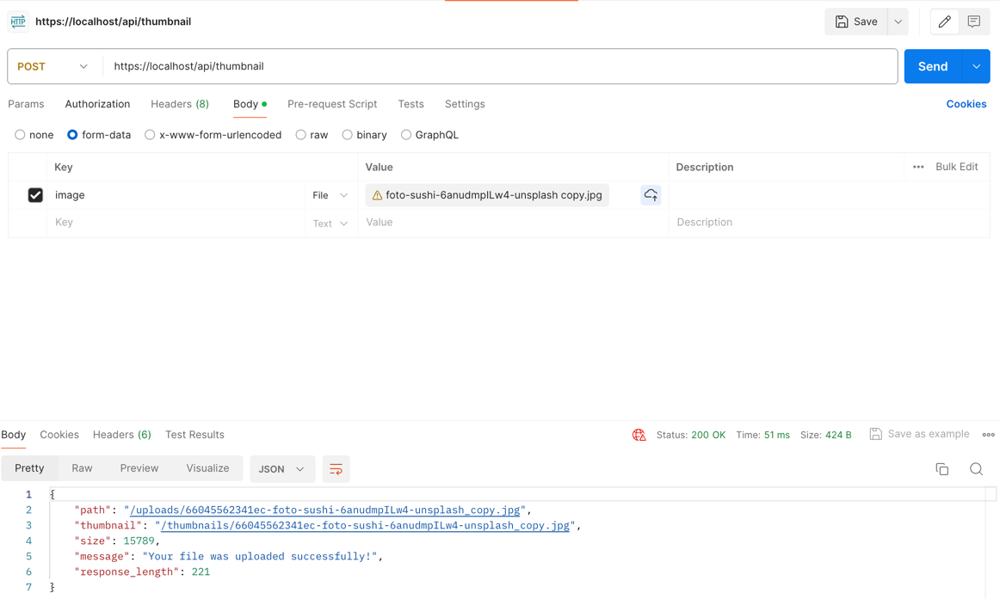
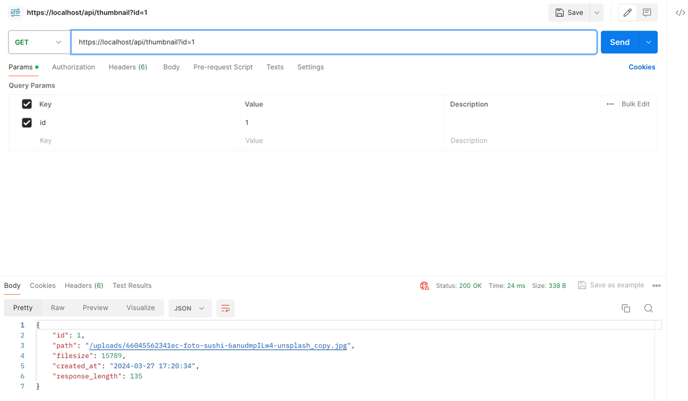

# Willamette Guest Talk Project

This project was created for a guest talk at Willamette University (https://willamette.edu/). It is a simple PHP API that allows users to upload images and receive thumbnails in return. The project is a great starting point for learning about PHP development and can be expanded upon in many ways.

PHP Example Project Demonstrating:

- PHP API with PSR-7 (guzzlehttp/psr7)
- SQLite Database

## Introduction

This project illustrates some fundamental ideas of PHP development, such as Request/Response Handling Concepts with Middleware, and offers a basic example application of a PHP API with Sqlite, PHPUnit. It's also a great opportunity to dive deeper if desired. The API accepts JPG images that are uploaded to the server and returned as a thumbnail. A Sqlite file contains the database. Unit tests written with PHPUnit are part of the project.

### Directory Structure

- `src/` contains the core application classes
- `app/` contains the application logic
- `public/` contains the entry point for the API and uploaded files

## Helpful Links

- PHP Standards Recommendations: https://www.php-fig.org/psr
- https://medoo.in/

## Installation & Class Autoloading

This project uses Composer to autoload classes. To install Composer, run the following command:

    curl -sS https://getcomposer.org/installer | php

This project uses the PSR-4 autoloading standard (https://www.php-fig.org/psr/psr-4/). To install the dependencies and
autoloader, run the following command:

    php composer.phar install

## Run Frankenphp Webserver

You can get a dev server up and running easily with https://frankenphp.dev/ by running the following command (Docker required):

Build:

    docker build -t willamette/guest-talk .

Run:

    docker run -v $PWD:/app/public \
    -v $PWD/conf:/etc/caddy \
    -p 443:443 \
    willamette/guest-talk

Then open your browser at `https://localhost`.

See `./conf/Caddyfile` for the Caddy Configuration.

All requests are rewritten to `public/api.php` which is the entry point for the API.

## Database

All Sqlite related functionalities are handled with the help of the Medoo Framework: https://medoo.in/

Delete `database.db` and the class at `src\Database\Database.php` will create a new database file with a fresh table.


## Endpoints

### `POST /thumbnail`
Send `form-data` to this route with an `upload` field containing the binary.

Uploads an image file to the server. The image is stored in the `uploads` directory and a thumbnail is created in the `thumbnails` directory. Also, an entry is written into the SQLite database.

The server responds with a JSON with the following structure if successful (`HTTP 201`):

```json
{
  "status": "success",
  "message": "Image uploaded successfully",
  "id": 1,
  "path": "/uploads/1.jpg",
  "thumbnail": "/thumbnails/1.jpg"
}
```

#### Example: Uploading an Image with Postman


### `GET /thumbnail?id={id}`

Retrieve the thumbnail path of an image by its ID.

You'll receive a JSON response with the following structure if successful (`HTTP 200`):

```json
{
  "created_at": "2024-01-01 00:00:00",
  "thumbnail": "/thumbnails/1.jpg"
}
```

#### Example Postman Response



## Get Involved! Possible Assignments

* Write PHPUnit Tests to test both endpoints
* Secure the Upload endpoint with a Middleware and only allow authenticated users to upload images (for example, with a secret password that is sent in the request headers)
* Since the Uploads are stored in the Database, separate the two concerns into two endpoints: One for Uploading files, and one for generating Thumbnails
* Create multiple thumbnail variations, like black/white images or different sizes, cropping

## Run Tests

Tests are located in the `/tests/` directory. Run the following command to execute the tests:

    ./vendor/bin/phpunit tests

### License

This project is licensed under the MIT License - see the [LICENSE.md](LICENSE.md) file for details.

